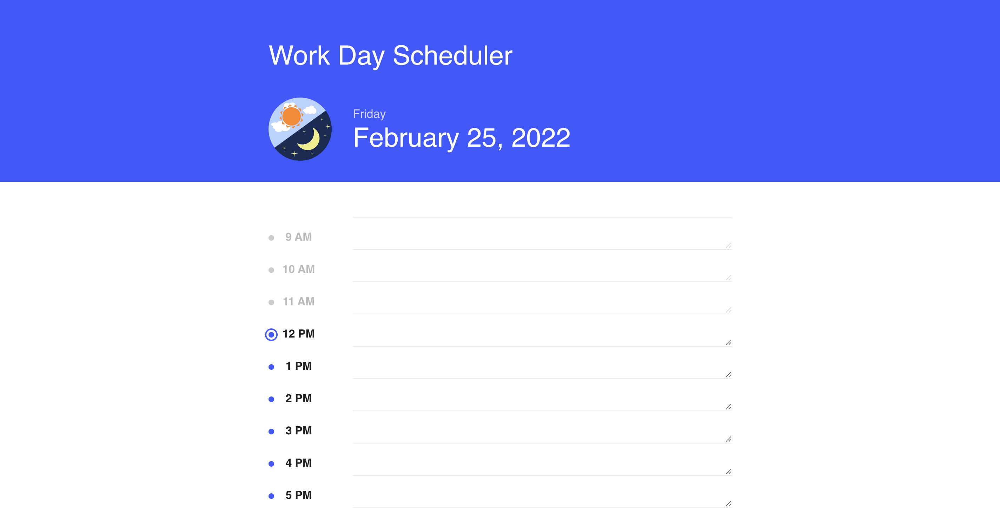
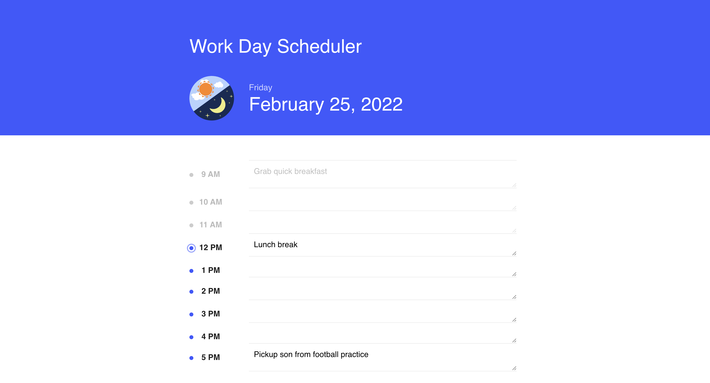

# Work-Day-Scheduler
   

  ## Table of contents:
 * [Description](#description)
 * [Installation](#installation)
 * [Usage](#usage)
 * [Contributors](#contributors)
 * [Questions](#questions)
  ### Description:
  This is a program that allows you to keep track of your busy schedule by structuring your day in hourly time blocks. The daily scheduler allows reminders to be     saved(through use of local memory) and you can periodically check in to see if you forgot something. 
  
  Screenshots of running program:  
  
  Link to deployed website: https://aden-abdirahman.github.io/Work-Day-Scheduler/
  
  ### Installation:
  No need to install anything to use this app!
  ### Usage:
  Example of how to use this program: You can use this app by going to my deployed website and typing anything into the search area of the hour you're trying to set    a reminder for. The current hour will have a pulsating blue circle next to it. Anything written in the textarea is saved by pressing enter inside the search bar.
  ### License:
  This project is licensed under: MIT
  ### Contributors:
  Abdirahman

  ### Questions:
  If you have any questions contact Abdirahman on [Github](https://github.com/aden-abdirahman)
  or [Email](https://aden.abdirahman45@gmail.com)
